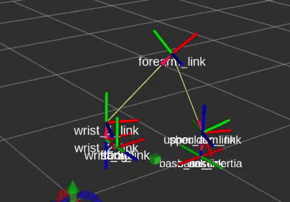

# UR10e Pick & Place Simulation (ROS + MoveIt)

This project demonstrates a complete pick-and-place motion planning pipeline using a UR10e robotic arm in RViz, powered by ROS Noetic and MoveIt.

Features:
-UR10e robot arm simulation
-MoveIt-based planning pipeline
-Object pick using `attach_box()`
-Object place using `detach_object()`
-Collision-aware motion planning in a realistic scene

Below is a live simulation GIF showing the full pick and place sequence.

Demo: 

Dependencies

- Ubuntu 20.04 + ROS Noetic
- MoveIt 1.1+
- Universal Robots `ur10e` packages
- Python 3.x

How to Run:
roslaunch ur10e_moveit_config demo.launch
rosrun ur10e_pick_place ur10e_pick_place_test.py
*Make sure the script is executable:*
chmod +x scripts/ur10e_pick_place_test.py

Project Structure:
ur10e_pick_place/
├── scripts/
│   └── ur10e_pick_place_test.py
├── assets/
│   └── demo.gif
└── README.md

Author:
Jongsang Yoo
Mechanical Engineering Student @ University of Toronto 
Focused on Robotics, Industrial Automation, and Motion Planning 

Future Work:
Add place object for full symmetry
Gripper control simulation
Gazebo integration for physics-based validation

