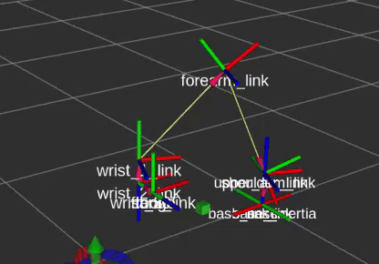

# UR10e Pick & Place Simulation (ROS + MoveIt)

A motion planning simulation of a **UR10e industrial robotic arm** performing a complete **pick-and-place task** using **ROS Noetic** and **MoveIt**.

This project demonstrates how motion planning, collision checking, and planning scene manipulation can be integrated to execute an automated pick-and-place pipeline in **RViz**.

---

## Project Overview

This project implements a full **pick-and-place manipulation workflow** for a UR10e robotic arm using the MoveIt motion planning framework.

The robot moves to a target object, simulates grasping by attaching the object to the end-effector, transports it to a new location, and releases it. The entire process is visualized in RViz and uses collision-aware motion planning to ensure safe trajectory generation.

---

## Demo

Below is a live simulation GIF showing the full pick-and-place sequence.



---

## Key Features

- UR10e robotic arm simulation in **RViz**
- Motion planning using the **MoveIt** planning pipeline
- Collision-aware trajectory generation
- Object pick simulation using `attach_box()`
- Object place simulation using `detach_object()`
- Planning scene manipulation with collision objects
- Python-based robot motion control

---

## System Architecture

This project combines several core ROS and MoveIt components:

### MoveIt Motion Planning
- Generates collision-free trajectories
- Plans arm motion for pick and place operations

### Planning Scene
- Represents the robot environment
- Stores collision objects used during manipulation

### Move Group Interface
- Controls the manipulator through Python
- Sends trajectory goals to the robot arm

### Object Interaction
- `attach_box()` simulates grasping the object
- `detach_object()` simulates releasing the object

---

## Dependencies

- Ubuntu 20.04
- ROS Noetic
- MoveIt 1.1+
- Python 3
- Universal Robots ROS packages

Required packages include:

- `universal_robot`
- `ur10e_moveit_config`
- `moveit_commander`
- `rospy`

---
---

## Project Structure

```bash
ur10e_pick_place/
├── scripts/
│   └── ur10e_pick_place_test.py
├── assets/
│   └── demo.gif
└── README.md
```

---

## Skills Demonstrated

- Robot Motion Planning  
- MoveIt Framework  
- ROS Node Integration  
- Collision-Aware Manipulation  
- Planning Scene Management  
- Industrial Robot Simulation  

---

## Future Improvements

Potential extensions for this project include:

- Gripper control simulation  
- Gazebo integration for physics-based validation  
- Perception pipeline for object detection  
- Autonomous grasp pose generation  
- Multi-object manipulation  

---

## Author

**Daniel Yoo**  
Mechanical Engineering Student, University of Toronto  

Interested in:

- Robotics  
- Industrial Automation  
- Motion Planning  
- Autonomous Systems

## How to Run

Launch the MoveIt demo environment:

```bash
roslaunch ur10e_moveit_config demo.launch
